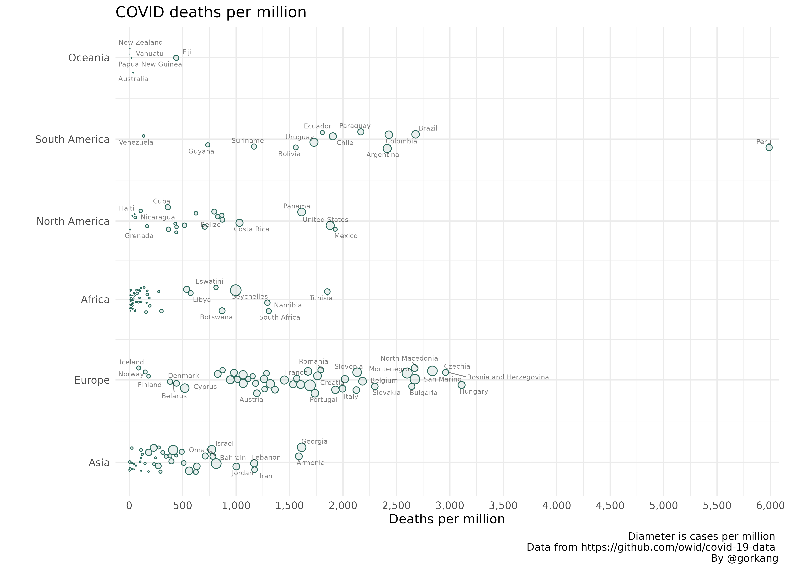

# linearpackcircles

<!-- badges: start -->
[](https://lifecycle.r-lib.org/articles/stages.html#experimental)
<!-- badges: end -->

The goal of linearpackcircles is to create circle packing visualizations along a linear scale. It uses {[packcircles](https://github.com/mbedward/packcircles)} as a backend.  

You can install the development version with `remotes::install_github("gorkang/linearpackcircles")`. Please report any problems you find in the [Issues Github page](https://github.com/gorkang/linearpackcircles/issues).  


## Example plot

With the [OWID dataset](https://github.com/owid/covid-19-data/tree/master/public/data) we can create a plot showing how `total_deaths_per_million` changes by `continent` and `location` (i.e. country), using `total_cases_per_million` for the circle diameter. 


```r 

# remotes::install_github("gorkang/linearpackcircles")

# Libraries and functions
library(readr)
library(dplyr)
library(linearpackcircles)

# Data
DF = read_csv("https://raw.githubusercontent.com/owid/covid-19-data/master/public/data/owid-covid-data.csv") %>% 
  filter(date == max(date)) # Keep only most recent data

# Plot
linearpackcircles(DF, 
                  
                  # Main variables
                  ID_var_str = "location",
                  group_var_str = "continent",
                  area_var_str = "total_cases_per_million",
                  x_var_str = "total_deaths_per_million",
                  
                  # Layout parameters
                  separation_factor = 15,
                  ratio_reduction_area = 60000,
                  ratio_reduction_x = 50,
                  height_y = 5,
                  
                  # Text labels
                  max_overlaps = 8,
                  
                  # Plot parameters
                  title = "COVID deaths per million",
                  x = "Deaths per million",
                  caption = "Diameter is cases per million \n 
                             Data from https://github.com/owid/covid-19-data \n
                             By @gorkang",
                  size_text = 3)

```

---  





## Saving plots

To save the plot you can store the output of `linearpackcircles()` in a variable and use `ggsave()`, or just add a few parameters to `linearpackcircles()`.  

```r

linearpackcircles(DF,

                  # Main variables
                  ID_var = "location",
                  group_var = "continent",
                  area_var = "total_cases_per_million",
                  x_var = "total_deaths_per_million",

                  # Layout parameters
                  separation_factor = 30,
                  ratio_reduction_area = 6000,
                  ratio_reduction_x = 20,
                  height_y = 10,

                  # Save plot
                  save_plot = TRUE,
                  filename = "test_plot.png",
                  width = 15,
                  height = 12,
                  dpi = 150
)

# File saved in: test_plot.png 

```
