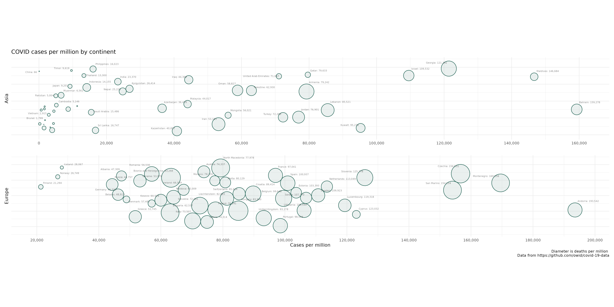

# linearpackcircles

<!-- badges: start -->
<!-- badges: end -->

The goal of linearpackcircles is to create circle packing visualizations along a linear scale. It uses {[packcircles](https://github.com/mbedward/packcircles)} as a backend.  

## Example plot

Run owid.R to create the following plot:  

